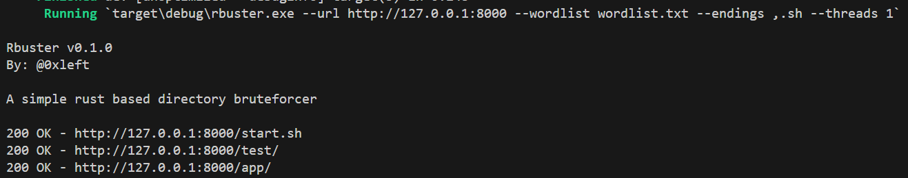

# I had to do it

## Description

Yet anothe directory bruteforcer using my new found rust skills (at least I like to think so :()

## Usage

```bash
rbuster --url http://127.0.0.1:8000 --wordlist wordlist.txt --endings ",.sh" --threads 10
```

